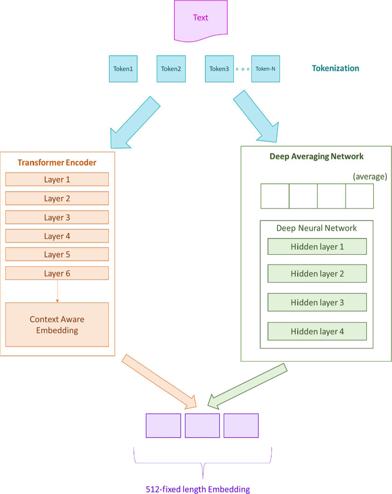
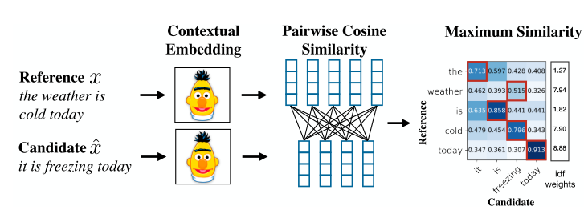
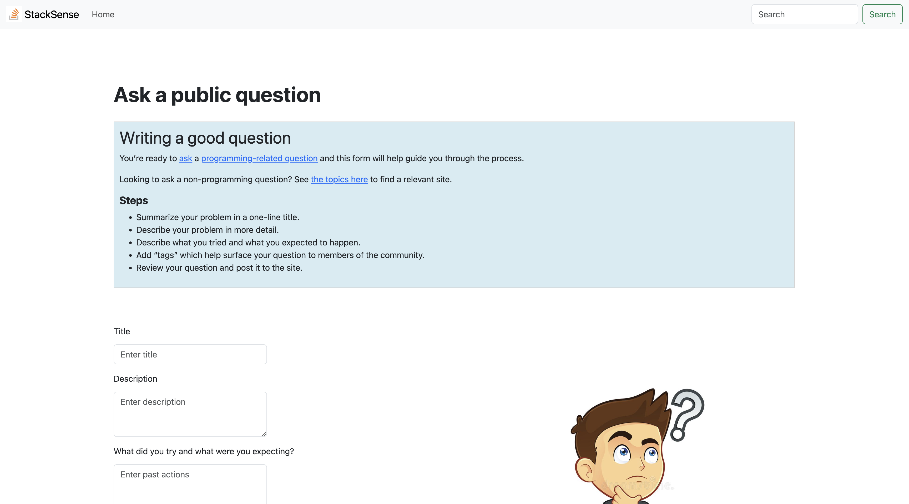
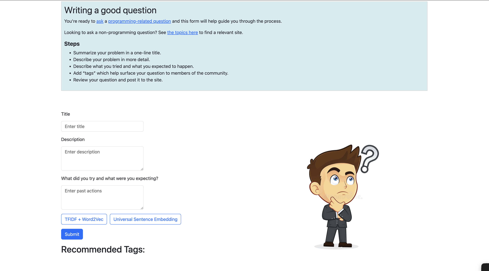
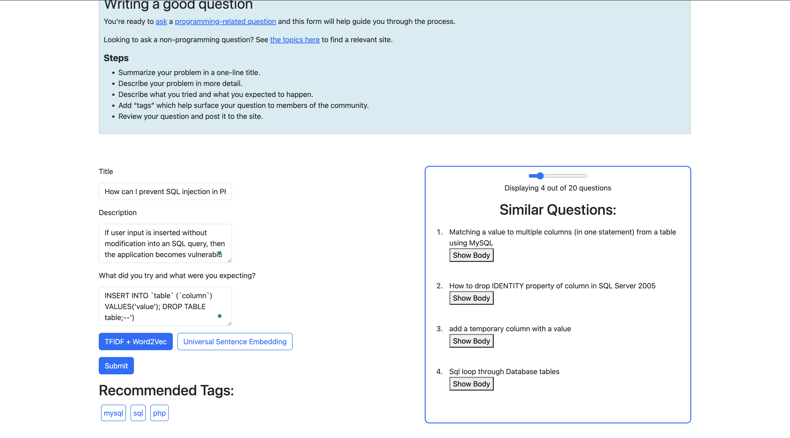
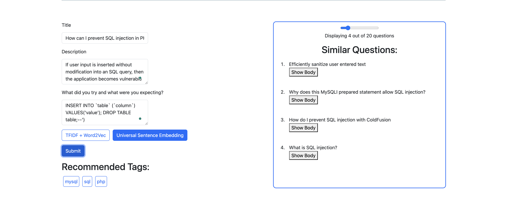
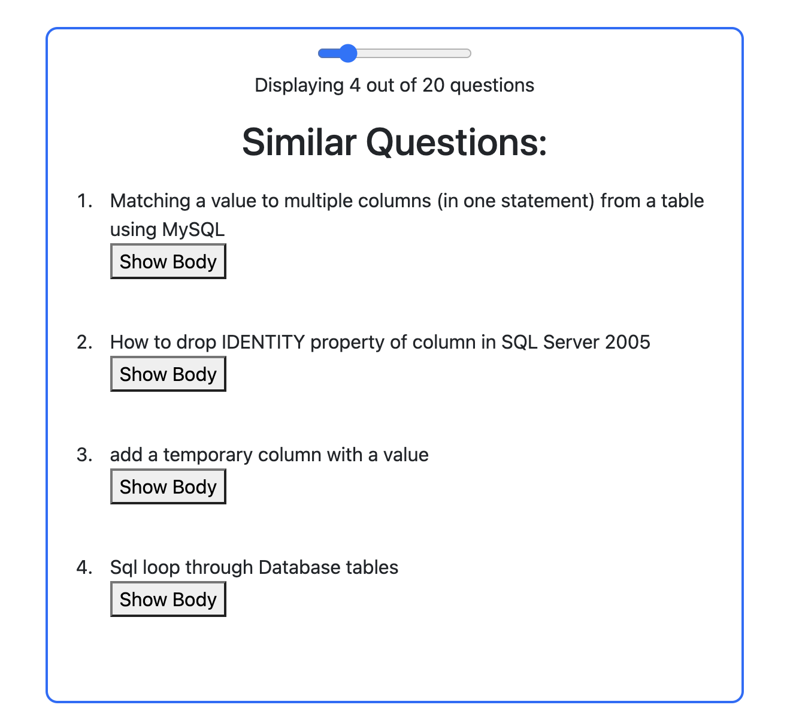
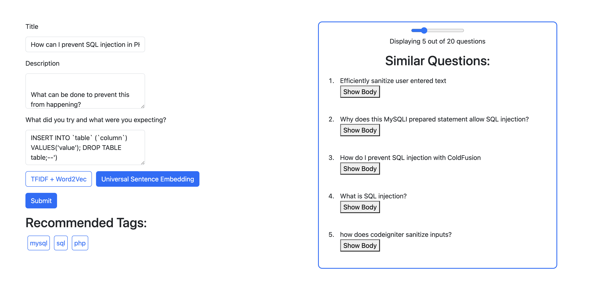

# StackSense

This is a part of the CSCE 670 (Information Storage and Retrieval) project.

[2 Min Video Presentation](https://www.youtube.com/watch?v=moHQKFcGLdY)

[Slides](https://drive.google.com/file/d/1aXUbClkMWZTAJSOCAaURsCB9n_A4AyyS/view?usp=sharing)

[GitHub Repo](https://github.com/yashpatil17/StackSense)

## Introduction

StackSense is a tool designed to enhance the user experience on StackOverflow by providing accurate tag suggestions and suggesting similar questions. It predicts tags for questions/posts, suggests similar questions using various document similarity algorithms and presents these functionalities in a user-friendly application.

## Problem Statement

The tool caters to StackOverflow users seeking tag suggestions for better question visibility, users looking for efficient problem-solving through similar questions, and professionals interested in recommendation systems and text analysis. While similar tools exist, StackSense differentiates itself by focusing on accuracy in tag suggestions and efficiency in recommending similar questions specific to StackOverflow's context. The project employs a multidisciplinary approach, utilizing existing resources such as NLP libraries, ML frameworks, and pre-trained models. This comprehensive approach enables us to effectively mine data, preprocess it, and develop accurate prediction models for tag suggestions and question recommendations.

## Dataset

[Stack Overflow Dataset](https://www.kaggle.com/datasets/stackoverflow/stacksample)

## Data Preprocessing

### Data Loading and Cleaning:

- Loaded and cleaned Questions.csv and Tags.csv.
- Dropped duplicates and null values.
- Dropped questions with low scores.
- Removed questions not belonging to the top 100 tags.

### Text Preprocessing:

- Normalized text by removing HTML tags, accented characters, and stopwords.
- Lemmatized text and cleaned punctuation.

### Exploratory Data Analysis (EDA):

- Visualized tag distribution and selected dominant tags.
- Analyzed text length distribution and identified outliers.

## Model Information

### Tag Prediction

We trained two models for the dataset:

- LinearSVC
- Fine-tuned BERT

For BERT, we used the pre-trained bert-base-uncased model and fine-tuned it on our dataset with a dropout layer, the output of which was sent to the final layer with no of outputs = no of labels (=100).

### Evaluation

We evaluated our models based on the precision, recall, and f1 score on the test data. Results:

#### LinearSVC

- Precision: 0.8014119790480528
- Recall: 0.41618702199795
- F1-score: 0.5478606087340098
- Hamming loss: 0.01083711673611543
- Jaccard score: 0.3772782503037667

#### BERT

- Precision: 0.8573477845074913
- Recall: 0.4241110147441457
- F1-score: 0.5674948567811362
- Hamming loss: 0.010198395422600908
- Jaccard score: 0.396155545735749

Based on the scores, we observed that BERT performed far better than LinearSVC. Also, BERT predicted the tags correctly even on unseen questions which were not part of the database. So, we decided to use BERT for the tag prediction.

### Question Recommendation

We experimented with DistilBERT embeddings due to their ability to capture word context effectively. However, we found that using DistilBERT significantly increased prediction time, particularly when converting raw text to vectors for search engine queries. Given the importance of low latency in search engine applications, we opted for the Universal Sentence Encoder instead. Its faster processing speed better aligns with the requirement for quick response times in question recommendations.

For question recommendation, we employ item-item Collaborative Filtering (CF). Features are extracted using Word2Vec, TF-IDF, and Universal Sentence Encoder. We then use K-Nearest Neighbors (KNN) and cosine similarity to find similar questions. KNN is selected for its effectiveness in identifying similar items.

## Future Scope

In the future, StackSense could be expanded in several ways to enhance user experience and recommendation accuracy. Firstly, incorporating user profiles by gathering and analyzing user activity data would enable personalized recommendations. This involves extracting relevant features and applying techniques like collaborative filtering to compute user similarity and generate tailored suggestions based on similar users' preferences. Additionally, increasing the training data beyond the current 10% could improve model performance and recommendation quality by capturing more diverse patterns and trends. Furthermore, developing a StackOverflow Tag Predictor Extension would provide real-time tag predictions as users compose their questions, enhancing the tagging process and improving question visibility. These advancements could significantly elevate the usability and effectiveness of StackSense in providing accurate and personalized recommendations to its users.

## Project Setup

## Server

The server-side code is located in the `server` directory. The main file, `server.py`, is built using Flask, a lightweight WSGI web application framework in Python.

### Installation

1. Navigate to the `server` directory.
2. Install dependencies: `pip install -r requirements.txt`
3. Run the server: `python server.py`

## Client

The client-side code is located in the `client` directory. It is developed using React, a JavaScript library for building user interfaces.

### Installation

1. Navigate to the `client` directory.
2. Install dependencies: `npm install`
3. Start the development server: `npm start`

## Embeddings and Models

The `embeddings` and `models` folders in the root directory contain all the embeddings and model weights necessary for the project.
If not present down all the files from [Link1](https://drive.google.com/drive/folders/1DOXw56d8L_riM6O2biOh8RC_MjchbyHs) and [Link2](https://drive.google.com/drive/folders/124W00gZwCj1clAOm5hzRG8czeD6vo1B0) and put them in embeddings folder.

Download and paste the BERT model in the models directory: [BERT](https://drive.google.com/file/d/1Q1EcYjj-_Ea5rGsHzdM3Rq-hyQ_nUPSc/view)

Download and put this dataset without preprocessing in the root folder StackSense: [Data](https://drive.google.com/file/d/1Q0hD6AfSMw_-q7e_2HNvJPQJFy8aVyLI/view?usp=drive_link)

## Screenshots
*Home Screen*

*Ask a Question*

*Example Input Question*

*Example Output*

*Similar Questions with a slider to toggle the number of displayed questions*

*Example output using Universal Sentence Encoder*

## Contributing

Contributions are welcome!

